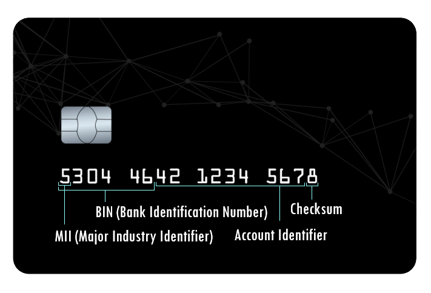

# Bank system description

This project is a solution to an exercise which appeared in [JetBrains Academy](https://www.jetbrains.com/academy/)

## How credit card numbers work

We live busy lives these days. Between work, chores, and other things in our to-do lists, it can be tough to catch your breath and stay calm. Credit cards are one of the things that save us time, energy, and nerves. From not having to carry a wallet full of cash to consumer protection, cards make our lives easier in many ways. In this project, you will develop a simple banking system with a database.

If you’re curious about business, technology, or how things around you work, you'll probably enjoy learning how credit card numbers work. These numbers ensure easy payments, and they also help prevent payment errors and fraud. Card numbers are evolving, and they might look different in the near future.

Let's take a look at the anatomy of a credit card:


The very first number is the **Major Industry Identifier (MII)**, which tells you what sort of institution issued the card.

- 1 and 2 are issued by airlines
- 3 is issued by travel and entertainment
- 4 and 5 are issued by banking and financial institutions
- 6 is issued by merchandising and banking
- 7 is issued by petroleum companies
- 8 is issued by telecommunications companies
- 9 is issued by national assignment

In our banking system, credit cards should begin with 4.

The first six digits are the **Issuer Identification Number (IIN)**. These can be used to look up where the card originated from. If you have access to a list that provides detail on who owns each IIN, you can see who issued the card just by reading the card number.

Here are a few you might recognize:

- Visa: 4*****
- American Express (AMEX): 34**** or 37****
- Mastercard: 51**** to 55****

In our banking system, the IIN must be 400000.

The seventh digit to the second-to-last digit is the **customer account number**. Most companies use just 9 digits for the account numbers, but it’s possible to use up to 12. This means that using the current algorithm for credit cards, the world can issue about a trillion cards before it has to change the system.

We often see 16-digit credit card numbers today, but it’s possible to issue a card with up to 19 digits using the current system. In the future, we may see longer numbers becoming more common.

In our banking system, the customer account number can be any, but it should be unique. And the whole card number should be 16-digit length.

The very last digit of a credit card is the **check digit** or **checksum**. It is used to validate the credit card number using the Luhn algorithm, which we will explain in the next stage of this project. For now, the checksum can be any digit you like.

## Strategies to generate credit card numbers

In this project, we try to show two ways to do it.

1. The easiest one is generating a random number
2. Apply any algorithm like LuhnAlgorithm

## Tecnical

This code is inspired by SOLID principles.

The purpose of this project is try to show:

- A flexible way to handle menus. NOT huge if-else statements
- Be able to manage different storages without coupling
- Apply composition concept
- Apply builder, abstract method, strategy, state, facade patterns

Note: **THERE IS NOT FULL ERROR HANDLING**

## Extra instructions

In order to run the program, please type the following command on a terminal

```console
python run.py
```


### Features

- Generate new credid cards and their pin
- Show and modify the balance of the account
- Destroy an account
- Transfer money between accounts
- Some extras.


Please, feel free to send me any feedback.

marvinalexz@gmail.com
